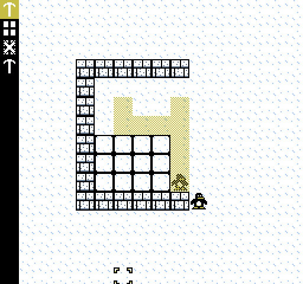
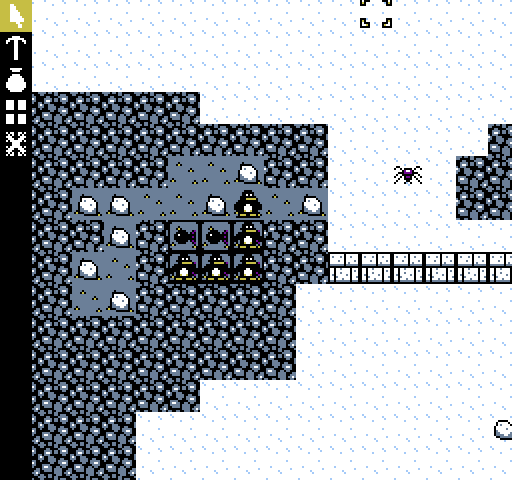
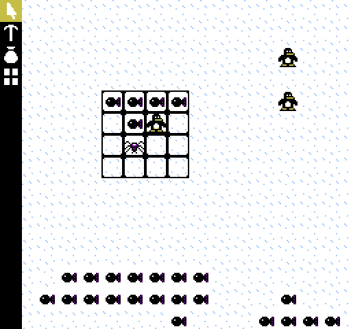
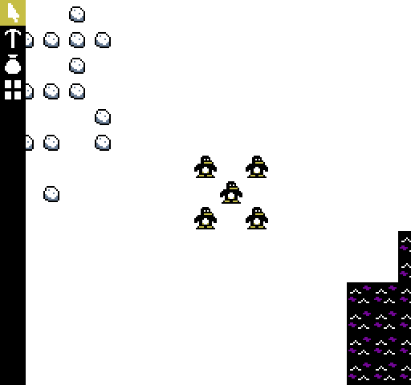
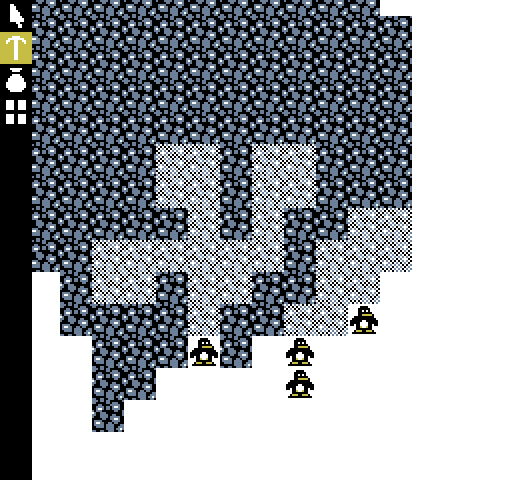
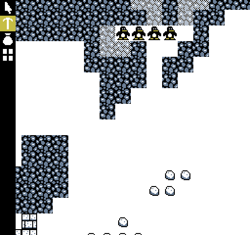

## What is Arctia?
Arctia is a small game inspired by Dwarf Fortress and Rimworld.
I am writing Arctia for practice, for fun, and as a tribute to the
"automated villagers" city-building game genre.

Tux and his friends were surprised when a huge ice chunk drifted
into the nearby sea.  The chunk was so huge that some penguins packed
their bags and decided to stake out a piece of the chunk to live on.
The elders call this new land "Arctia", and you are leading a colony
of penguin settlers on this new territory.

## Controls
You can switch tools by clicking the menu buttons on the left.

To designate areas using tools, click on tiles within the world.

To scroll across the map, right-click and drag.

## Running
If you just want to play the game (without developing it), I recommend
installing it with `pip` in one of the following ways.

To install it straight from Github (requires Git):

    pip install git+https://github.com/unternehmen/arctia

To install it from a downloaded copy:

    cd arctia-0.1.0   # Or whichever version you have
    pip install .

After it is installed, you can run it with this command:

    arctia

## Developing
On the other hand, if you want to develop the game, you should install
it this way.  Clone the repository with Git, i.e.:

    git clone https://github.com/unternehmen/arctia

Then, navigate to the directory and install arctia as "editable":

    cd arctia
    pip install -e .

Once it is installed, you can work on the source code as much as you
want, and the installed copy will stay updated.  To run the program,
just run the command:

    arctia

## Testing
There are some tests to make sure that certain parts of the code
work correctly.  To run the tests, you can run the following command:

    python setup.py test

## Screenshots

### Commit e5fdcee63005f020c4cad64385209555270f93ae

### Commit 96698a3352e01aaff8c70d986c122655b199061d

### Commit 0c96592a2e70ea08f9cc421e08f9d2ef74916498

### Before Commit 0c96592a2e70ea08f9cc421e08f9d2ef74916498

## License
This is free and unencumbered software released into the public domain.

Anyone is free to copy, modify, publish, use, compile, sell, or
distribute this software, either in source code form or as a compiled
binary, for any purpose, commercial or non-commercial, and by any
means.

For more information, see the LICENSE file included in this project
or refer to <http://unlicense.org>

♡2017 by unternehmen.  Copying is an act of love.
